# DEIM - DETR with Improved Matching

> **High-Performance Object Detection for Thermal Imaging in Mining Environments**

A production-ready Python module for thermal object detection, optimized for vehicle undercarriage and side monitoring in North Australian mining operations. Built on DEIM (DETR with Improved Matching) architecture with HGNetv2 backbone.

[](https://www.python.org/downloads/)
[](https://pytorch.org/)
[](LICENSE)

---

## 🎯 Features

- **🔥 Thermal-Optimized**: Handles colormap variations across -10°C to 50°C environmental temperatures
- **⚡ Simple API**: Train and infer in <10 lines of code (like Ultralytics YOLO)
- **🎨 Advanced Augmentation**: Mining-specific transforms (heat shimmer, dust, motion blur)
- **📊 Two-Stage Training**: Stage 1 (89%) with aggressive augmentation, Stage 2 (11%) clean fine-tuning
- **🔄 Auto-Scaling**: Epoch-dependent parameters automatically adjust with custom training lengths
- **📁 Auto-Detection**: Supports COCO and YOLO annotation formats
- **🎥 Multi-Input**: Images, videos, directories, batches
- **👁️ Visualization**: Built-in supervision package integration

---

## 🏗️ Architecture Overview


### Component Deep-Dive

#### 1. **HGNetv2 Backbone** (PP-HGNetV2)

**Purpose**: Efficient feature extraction optimized for GPU inference

**Key Innovations**:
- **Learnable Affine Blocks (LAB)**: Adaptive feature scaling and biasing
- **ESE Module**: Efficient Squeeze-and-Excitation for channel attention
- **Light ConvBNAct**: Depthwise separable convolutions for efficiency
- **Multi-Stage Design**: Progressive feature abstraction

**Architecture Flow**:

```mermaid
graph TD
    A[Input 3x640x640] --> B[Stem Block<br/>3→16→16 channels]
    B --> C[Stage 1<br/>16→64 channels<br/>No downsample]
    C --> D[Stage 2<br/>64→256 channels<br/>Stride 2]
    D --> E[Stage 3<br/>256→512 channels<br/>Stride 2<br/>Light blocks]
    E --> F[Stage 4<br/>512→1024 channels<br/>Stride 2<br/>Light blocks]

    E -.-> G[Output: 512 channels<br/>Feature stride 16]
    F -.-> H[Output: 1024 channels<br/>Feature stride 32]

    style G fill:#90EE90
    style H fill:#90EE90
```


**Why HGNetv2 for Thermal Mining?**

1. **Efficiency**: 7.1 GFLOPs / 3.5 GMACs - runs real-time on edge GPUs
2. **Multi-Scale**: Extracts features at stride 16 & 32 for various object sizes
3. **LAB Blocks**: Adapt to colormap variations (-10°C to 50°C environments)
4. **Light Blocks**: Stages 3-4 use efficient depthwise convolutions
5. **Pretrained**: ImageNet-pretrained for faster convergence

**B0 Configuration** (used in `under` and `sides`):
- **Parameters**: 3.7M
- **Stem**: 3 → 16 → 16 channels
- **Output Channels**: [512, 1024] at strides [16, 32]
- **Kernel Sizes**: Stage 1-2 use 3×3, Stage 3-4 use 5×5
- **Layer Depth**: 3 layers per HG_Block

#### 2. **Hybrid Encoder**

**Purpose**: Bridge backbone features to transformer decoder with cross-scale fusion

**Configuration** (`under` & `sides`):
```yaml
in_channels: [512, 1024]    # From HGNetv2 stages 3-4
feat_strides: [16, 32]      # Spatial resolutions
hidden_dim: 128             # Compressed feature dimension
dim_feedforward: 512        # FFN hidden size
expansion: 0.34             # Cross-scale expansion ratio
depth_mult: 0.5             # Network depth multiplier
```

**Flow**:


#### 3. **DFINE Transformer Decoder**

**Purpose**: Detection-focused transformer with improved matching

**Key Features**:
- **Deformable Attention**: Adaptive sampling points (6 per level)
- **Improved Matching**: Better query-target assignment
- **Query Denoising**: Stabilizes training
- **Multi-Level**: Processes features at 2 scales

**Configuration**:
```yaml
num_layers: 3               # Decoder depth
hidden_dim: 128            # Feature dimension
num_queries: 300           # Detection queries
num_points: [6, 6]         # Deformable attention points
num_denoising: 100         # Denoising queries
```

---

## 🚀 Quick Start

### Installation

```bash
# Clone repository
cd /path/to/DEIM

# Install dependencies
pip install -r requirements.txt

# Install module
pip install -e .
```

### Training

```python
from deim import DEIM

# Initialize with config
model = DEIM(config='under')  # or 'sides'

# Train from scratch
model.train(
    epochs=400,           # Auto-scales to 356 (Stage 1) + 44 (Stage 2)
    batch_size=32,
    learning_rate=0.001
)

# Transfer learning
model.train(
    pretrained='base_model.pth',
    epochs=100
)
```

### Inference

```python
from deim import DEIM

# Load trained model
model = DEIM(config='under')
model.load('deim_outputs/under/20241002_143022/best_stg1.pth')

# Single image
results = model.predict('truck_thermal.jpg', visualize=True)

# Batch processing
results = model.predict([
    'image1.jpg',
    'image2.jpg',
    'image3.jpg'
])

# Video processing
results = model.predict(
    'thermal_video.mp4',
    save_path='output_annotated.mp4',
    conf_threshold=0.5
)

# Directory
results = model.predict(
    'thermal_images/',
    save_dir='outputs/',
    visualize=True
)
```

---

## 📊 Two-Stage Training Strategy


### Stage 1 (Epochs 1-356, 89%)

**Purpose**: Robust feature learning under mining conditions

**Active Augmentations**:
```yaml
- RandomPhotometricDistort (p=0.5)    # Colormap variations
- GaussianBlur (p=0.3)                # Heat shimmer, dust, motion
- RandomRotation (±10°, p=0.5)        # Vehicle angles
- RandomPerspective (p=0.3)           # Camera position
- RandomAdjustSharpness (p=0.3)       # Thermal focus variation
- RandomZoomOut                        # Distance variation
- RandomIoUCrop (p=0.8)               # Partial frame entry/exit
- RandomHorizontalFlip                # Symmetry augmentation
```

### Stage 2 (Epochs 357-400, 11%)

**Purpose**: Clean fine-tuning on exact thermal representations

**Active**: Resize + Normalization only

**Why This Works**:
- Stage 1 teaches robustness to environmental variations
- Stage 2 corrects overfitting and refines predictions
- 89/11 split maximizes augmentation exposure while ensuring clean convergence

---

## 🎨 Thermal-Specific Augmentations

### Environmental Challenges

| Challenge | Temperature Range | Augmentation Solution |
|-----------|------------------|----------------------|
| **Ambient Variation** | -10°C to 50°C | RandomPhotometricDistort |
| **Heat Shimmer** | Hot undercarriage | GaussianBlur |
| **Dust/Particulates** | Mining roads | GaussianBlur |
| **Vehicle Motion** | Fast-moving trucks | GaussianBlur + RandomRotation |
| **Camera Mounting** | Slight misalignment | RandomPerspective |
| **Thermal Focus** | Variable camera focus | RandomAdjustSharpness |
| **Frame Entry/Exit** | Partial visibility | RandomIoUCrop |

### Colourmap Handling

**Problem**: Environmental temperature (-10°C to 50°C) shifts the entire colormap, drastically changing object appearance.

**Solution**: RandomPhotometricDistort simulates these shifts during training, making the model colormap-invariant while preserving thermal signature recognition.

---

## 📁 Configuration

### Pre-configured Models

#### `under` - Undercarriage Detection
```yaml
Camera Position: Road-mounted, looking UP
View: Vehicle undercarriage
Objects: Engine, exhaust, drivetrain, hot spots
Training: 320 epochs (285 aug + 35 clean)
Batch Size: 8
```

#### `sides` - Side Profile Detection
```yaml
Camera Position: 90° to truck wheels
View: Side profile
Objects: Wheels, brakes, suspension, overheating components
Training: 80 epochs (71 aug + 9 clean)
Batch Size: 32
```

### Custom Configuration

```python
# Create custom YAML config
model = DEIM(config='path/to/custom.yml')
model.train(epochs=200)

# Override at runtime
model = DEIM(config='under')
model.train(
    epochs=500,              # Auto-scales to 445 (89%) + 55 (11%)
    batch_size=16,
    learning_rate=0.0005,
    dataset_path='/custom/dataset'
)
```

---

## 📂 Dataset Structure

### COCO Format
```
dataset/
├── annotations/
│   ├── instances_train.json
│   └── instances_val.json
└── images/
    ├── train/
    │   ├── thermal001.jpg
    │   ├── thermal002.jpg
    │   └── ...
    └── val/
        ├── thermal101.jpg
        └── ...
```

### YOLO Format
```
dataset/
├── train/
│   ├── thermal001.jpg
│   ├── thermal001.txt    # class x_center y_center width height
│   ├── thermal002.jpg
│   ├── thermal002.txt
│   └── ...
└── val/
    ├── thermal101.jpg
    ├── thermal101.txt
    └── ...
```

**Auto-detection**: The module automatically detects format on dataset load.

---

## 📈 Output Structure

```
deim_outputs/
├── under/
│   └── 20241002_143022/           # Timestamp
│       ├── best_stg1.pth          # Stage 1 checkpoint
│       ├── best_stg2.pth          # Stage 2 checkpoint (if applicable)
│       ├── config.yml             # Training config snapshot
│       └── logs/                  # TensorBoard logs
└── sides/
    └── 20241003_091530/
        └── ...
```

---

## 🔧 Development

```bash
# Linting
ruff check .

# Type checking
pyright .

# Run tests
pytest tests/
```

### Environment

- **Python**: 3.8+
- **PyTorch**: 2.0+
- **CUDA**: GPU required
- **Interpreter**: `/home/hidara/miniconda3/envs/deim/bin/python`

---

## 📖 Architecture References

### DEIM (DETR with Improved Matching)
- Improved query matching mechanism over vanilla DETR
- Faster convergence through better assignment
- Multi-scale deformable attention

### HGNetv2 (PP-HGNetV2)
- **Paper**: PaddlePaddle/PaddleDetection
- **Key Features**: Learnable Affine Blocks, ESE modules, lightweight design
- **Performance**: SOTA efficiency-accuracy trade-off for real-time detection

### D-FINE (Detection Transformer)
- **Decoder**: Deformable attention with adaptive sampling
- **Matching**: Hungarian matcher with improved cost functions
- **Loss**: VFL (Varifocal Loss) + GIoU + Local feature loss

---

## 🎯 Use Case: Mining Vehicle Monitoring

### Deployment Scenario


### Critical Detection Targets

| Camera | Objects of Interest | Temperature Range | Risk Level |
|--------|-------------------|------------------|-----------|
| **Under** | Engine, Exhaust, Drivetrain, Hydraulics | 80-200°C | Critical |
| **Sides** | Brakes, Wheels, Suspension, Bearings | 60-150°C | High |

---

## 📄 License

MIT License - See [LICENSE](LICENSE) file for details.

---

## 🙏 Acknowledgments

- **DEIM Architecture**: D-FINE Authors
- **HGNetv2 Backbone**: PaddlePaddle Team
- **Thermal Optimization**: Mining environment adaptations
- **Supervision**: Visualization package integration

---

## 📞 Support

For issues, questions, or feature requests:
- Open an issue on GitHub
- Check existing documentation
- Review example scripts in `/examples`

---

**Built for thermal imaging in extreme mining environments. Optimized for real-time GPU inference. Production-ready.** 🚛🔥